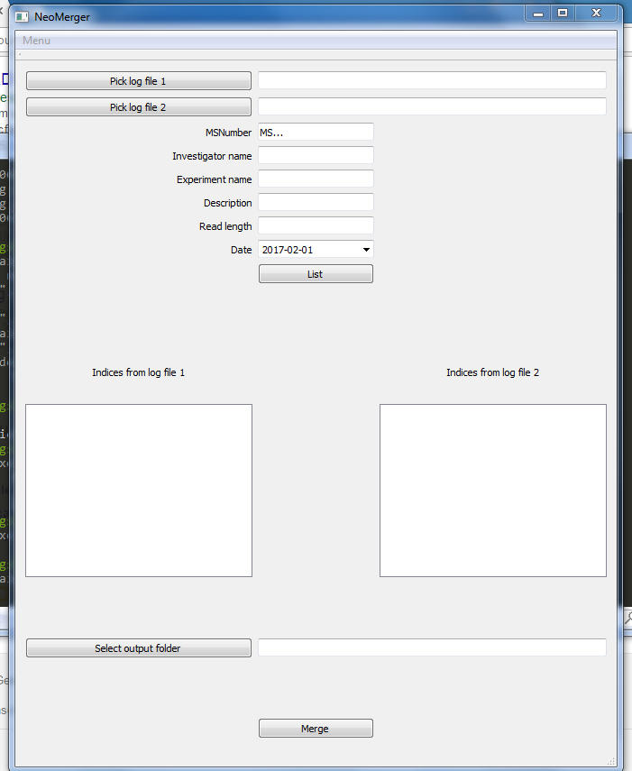

# A GUI program that did not last long

## History

This repo contains a project that was extremely short lived.

In late 2016 we were using Illumina NeoPrep for automatic library
preparation and Illumina MiSeq for sequencing. For our application (genotyping
of HIV for resistance testing), three NeoPrep runs would fit into two sequencing
runs. Stefan Schmutz had written a python program to extract the information
from two NeoPrep log files and write it into a single sample sheet to use on
the MiSeq.

In December 2016 we decided to write a simple GUI for this program so that all
technicians in the lab could use it.

On January 31st, Illumina announced that NeoPrep would be discontinued.

## Design of the GUI

The choice went to Qt, with PyQt5 python bindings. The interface was designed
in Qt Creator
(Project -> Right-Click -> Add New -> Qt Designer Form -> Main Window). This
creates a XML file with extension `.ui` that contains the interface. This
can be converted into python with `pyuic5 interfacefile.ui > interfacefile.py`
and imported from the main.

## Deployment

PyInstaller is a packaging tool that makes executable files for both Windows
and Mac. After some effort, we managed to install Qt and PyQt5 on Windows and
package everything into an executable.

### Convert the ico image to icns for Mac

    sips -s format tiff dlicon.ico --out dlicon.tiff
    tiff2icns -noLarge dlicon.tiff dlicon.icns
